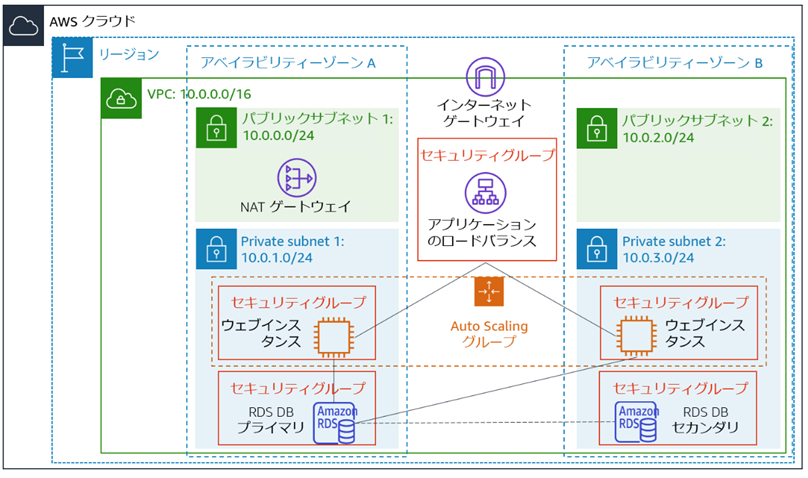

# Terraform を使用した AWS マルチティアインフラストラクチャ

このTerraformプロジェクトは、Webアプリケーション用の高可用性で本番環境に対応したAWSインフラストラクチャをデプロイします。

## アーキテクチャ



詳細なアーキテクチャドキュメントは、[architecture.md](architecture.md)を参照してください。

Claude Code のガイダンスについては、[CLAUDE.md](CLAUDE.md)を参照してください。

## ⚠️ AWS Academy ユーザーの方へ

このプロジェクトは AWS Academy の制限された IAM 権限と完全に互換性があります:
- 新しくIAMロールを作成する代わりに、既存の `EC2InstanceProfile` を使用
- **専用EC2インスタンス上のMySQL** (完全自動化、デフォルト構成)
- すべてのネットワーク、ALB、Auto Scaling 機能が完全に動作

**データベースソリューション:**
- ✅ **EC2ベースのMySQL**: 完全自動化、プライベートサブネット内の2インスタンス - [EC2_DATABASE.md](EC2_DATABASE.md)を参照

完全な互換性に関する注意事項は、[AWS_ACADEMY.md](AWS_ACADEMY.md)を参照してください。

### 主要コンポーネント

- **VPC** (10.0.0.0/16) 2つのアベイラビリティゾーンにまたがる
- **パブリックサブネット** Application Load Balancer と NAT Gateway 用
- **プライベートサブネット** Web アプリケーションインスタンスとデータベース用
- **Application Load Balancer** (ALB) トラフィック分散用
- **Auto Scaling Group** 2-6個のWebインスタンス (t3.small)
- **EC2上のMySQL 8.0** - プライベートサブネット内の2つのデータベースインスタンス (t3.small)
- **NAT Gateway** プライベートサブネットのインターネットアクセス用
- **セキュリティグループ** 最小権限アクセス制御

## 前提条件

1. **Terraform** >= 1.5.0
   ```bash
   terraform --version
   ```

2. **AWS CLI** 適切な認証情報で構成済み
   ```bash
   aws configure
   # または環境変数を使用:
   # export AWS_ACCESS_KEY_ID="your-access-key"
   # export AWS_SECRET_ACCESS_KEY="your-secret-key"
   # export AWS_DEFAULT_REGION="us-east-1"
   # export AWS_SESSION_TOKEN="your-session-token"  # 必要に応じて
   ```

   ※ すべての設定が正しいことを確認するには:
   ```bash
   aws sts get-caller-identity
   ```

3. **AWSアカウント** 以下のリソースを作成する権限が必要:
   - VPC、サブネット、インターネットゲートウェイ、NATゲートウェイ
   - EC2インスタンス、Auto Scaling Group、起動テンプレート
   - Application Load Balancer
   - RDSインスタンス
   - IAMロールとポリシー
   - セキュリティグループ

## クイックスタート

### 1. クローンと設定

```bash
# プロジェクトディレクトリに移動
cd cloud15

# terraform.tfvars を編集して値を設定
# 重要: 強力な db_password を設定してください!
```

### 2. Terraform の初期化

```bash
# プロバイダーとモジュールをダウンロード
terraform init
```

### 3. プランの確認

```bash
# 作成される内容をプレビュー
terraform plan
```

### 4. インフラストラクチャのデプロイ

```bash
# デプロイ (確認プロンプトが表示されます)
terraform apply

# または確認なしでデプロイ
terraform apply -auto-approve
```

### 5. アプリケーションへのアクセス

デプロイ完了後(10-15分)、Terraform が ALB の DNS 名を出力します:

```bash
# ALB の DNS 名を取得
terraform output alb_dns_url
```

ブラウザで `alb_dns_url` にアクセスしてアプリケーションを確認してください。


## 設定

### 必須変数

`terraform.tfvars` に設定する必要があります:

- `db_password` - RDSデータベース用の強力なパスワード (最低8文字)

### オプション変数

`terraform.tfvars` でカスタマイズできます (デフォルト値を表示):

```hcl
project_name               = "myapp"
environment                = "prod"
aws_region                 = "us-east-1"
vpc_cidr                   = "10.0.0.0/16"
web_instance_type          = "t3.small"
asg_min_size               = 1
asg_max_size               = 5
asg_desired_capacity       = 1
asg_target_cpu_utilization = 70
db_instance_class          = "db.t3.small"
db_name                    = "webapp"
db_username                = "admin"
```

設定可能な変数の完全なリストについては、`variables.tf` を参照してください。

## 出力値

デプロイ後、Terraform は以下の出力を提供します:

| 出力値 | 説明 |
|--------|-------------|
| `alb_dns_name` | ロードバランサーのDNS名 (アプリケーションへのアクセスに使用) |
| `rds_endpoint` | データベース接続エンドポイント |
| `vpc_id` | VPC識別子 |
| `nat_gateway_ip` | NATゲートウェイのパブリックIP (ホワイトリスト登録用) |

すべての出力値を表示:

```bash
terraform output
```

## 管理

### Auto Scaling と負荷テスト

インフラストラクチャは以下に基づいて **1から5インスタンス** まで自動的にスケールします:
- **CPU使用率**: 平均CPU > 70%でスケール
- **リクエスト数**: インスタンスあたり > 1000リクエストでスケール

スケーリングパラメータを手動で調整するには:

```bash
# terraform.tfvars を編集
asg_min_size         = 1
asg_desired_capacity = 2
asg_max_size         = 5

# 変更を適用
terraform apply
```

### 負荷テストの実行

このプロジェクトには、ALB に対して自動的に負荷を生成する専用のテストインスタンスが含まれています。

#### 1. 負荷テストの有効化

`terraform.tfvars` で以下の変数を設定し、変更を適用します。

```hcl
run_load_test = true
# オプション: 同時接続数と期間の調整
load_test_concurrency = 50
load_test_duration    = 0  # 0 は連続実行
```

```bash
terraform apply
```

#### 2. ダッシュボードへのアクセス

デプロイ後、テストインスタンスのパブリック IP にアクセスして、負荷テストのステータスを確認できます。

```bash
# テストインスタンスのパブリック IP を取得
terraform output test_instance_public_ip
```

ブラウザで `http://<test-instance-ip>` を開きます。

#### 3. 手動制御とモニタリング

テストインスタンスに SSH で接続（または EC2 Instance Connect を使用）して、負荷テストを直接制御できます。

```bash
# 負荷テストのステータス確認
sudo systemctl status load-test

# 負荷テストの停止
sudo systemctl stop load-test

# 負荷テストの開始
sudo systemctl start load-test

# リアルタイムログの表示
sudo journalctl -u load-test -f
```

### 設定の更新

```bash
# .tf ファイルまたは terraform.tfvars を変更
# 変更をプレビュー
terraform plan

# 変更を適用
terraform apply
```

### リソースの表示

```bash
# すべてのリソースをリスト
terraform state list

# 特定のリソースを表示
terraform show aws_lb.main

# 現在のステートを取得
terraform show
```

## モニタリング

### CloudWatch メトリクス

AWS CloudWatch でインフラストラクチャをモニタリング:

- **ALB**: リクエスト数、ターゲットレスポンス時間、正常なホスト数
- **Auto Scaling**: CPU使用率、ネットワークトラフィック、インスタンス数
- **RDS**: CPU、接続数、IOPS、レプリケーション遅延

### ログ

CloudWatch Logs が以下に対して有効化されています:
- RDS: エラーログ、一般ログ、スロークエリログ

### ヘルスチェック

ALB はインスタンスのヘルスチェックを実行します:
- パス: `/`
- 間隔: 30秒
- 正常しきい値: 2回連続成功
- 異常しきい値: 2回連続失敗

## セキュリティ

### ネットワークセキュリティ

- Web インスタンスとデータベースは**プライベートサブネット**にあり、直接インターネットアクセスなし
- NAT Gateway が制御されたアウトバウンドインターネットアクセスを提供
- セキュリティグループが最小権限アクセスを実装
- 多層セキュリティ: ALB → Web → データベース

### 暗号化

- RDS ストレージは保存時に暗号化
- HTTPS サポート準備完了 (ACM証明書を `alb.tf` に追加)

### シークレット管理

**重要**: `terraform.tfvars` をバージョン管理にコミットしないでください!

本番環境では、以下の使用を検討してください:
- データベース認証情報用の AWS Secrets Manager
- 設定用の AWS Systems Manager Parameter Store

### アクセス

- EC2 インスタンスは IAM ロールを使用 (アクセスキー不要)
- セキュアなインスタンスアクセス用に AWS Systems Manager Session Manager を有効化 (SSH キー不要)

## コスト最適化

### 現在の構成コスト (概算)

us-east-1 での月額コスト (2025年時点):

- NAT Gateway: 約$32/月 + データ転送
- Application Load Balancer: 約$16/月 + LCU料金
- EC2 (2x t3.small): 約$30/月
- RDS Multi-AZ (db.t3.small): 約$55/月
- EBS ストレージ (gp3): 約$2/月
- **合計**: 約$135-150/月 (データ転送除く)

### コスト削減のヒント

1. 予測可能なワークロードには、リザーブドインスタンスまたはSavings Plans を使用して30-75%割引
2. 開発/テスト環境にはシングルAZ RDSを検討 (本番環境には非推奨)
3. 需要に容量を合わせるために Auto Scaling を使用
4. 過剰プロビジョニングを避けるために RDS ストレージの自動スケーリングを有効化
5. CloudWatch メトリクスを確認してインスタンスサイズを適正化

## トラブルシューティング

### インスタンスが正常でない

```bash
# Auto Scaling Group の健全性を確認
aws autoscaling describe-auto-scaling-groups \
  --auto-scaling-group-names $(terraform output -raw web_asg_name)

# ターゲットの健全性を確認
aws elbv2 describe-target-health \
  --target-group-arn $(terraform output -raw alb_arn | sed 's/:loadbalancer/:targetgroup/')
```

### データベースに接続できない

1. セキュリティグループルールを確認
2. インスタンスが正しいサブネットにあることを確認
3. RDS エンドポイントを確認: `terraform output rds_endpoint`
4. ユーザーデータスクリプトの認証情報を確認

### Terraform エラー

```bash
# ステートを更新
terraform refresh

# 設定を検証
terraform validate

# コードをフォーマット
terraform fmt -recursive
```

## クリーンアップ

すべてのリソースを削除するには:

```bash
# 削除される内容をプレビュー
terraform plan -destroy

# インフラストラクチャを削除
terraform destroy

# または確認なしで削除
terraform destroy -auto-approve
```

**注意**: デフォルトでは、削除前に最終RDSスナップショットが作成されます。これをスキップするには、`terraform.tfvars` で `db_skip_final_snapshot = true` を設定してください。

## プロジェクト構造

```
.
├── README.md                   # このファイル
├── CLAUDE.md                   # Claude Code ガイダンス
├── architecture.md             # 詳細なアーキテクチャドキュメント
├── architecture.png            # アーキテクチャ図
├── versions.tf                 # Terraform バージョン制約
├── provider.tf                 # AWS プロバイダー設定
├── backend.tf                  # リモートステート設定
├── variables.tf                # 入力変数定義
├── outputs.tf                  # 出力値定義
├── terraform.tfvars            # 変数値 (git無視)
├── .gitignore                  # Git 無視ルール
├── vpc.tf                      # VPC とルートテーブル
├── subnets.tf                  # サブネット定義
├── nat.tf                      # NAT Gateway
├── security_groups.tf          # セキュリティグループルール
├── alb.tf                      # Application Load Balancer
├── launch_template.tf          # EC2 起動テンプレート
├── user_data.sh                # インスタンス初期化スクリプト
├── asg.tf                      # Auto Scaling Group
├── db_instance.tf              # EC2 上の MySQL
└── db_user_data.sh             # データベース初期化スクリプト
```

## 貢献

このコードベースでの作業に関するガイダンスについては、[CLAUDE.md](CLAUDE.md)を参照してください。

## ライセンス

このプロジェクトは教育およびデモンストレーション目的で提供されています。

## サポート

問題や質問については:
1. 詳細なドキュメントは [architecture.md](architecture.md) を確認
2. 開発ガイダンスは [CLAUDE.md](CLAUDE.md) を確認
3. 特定のサービスについては AWS ドキュメントを確認
4. Terraform ドキュメントを確認: https://www.terraform.io/docs
